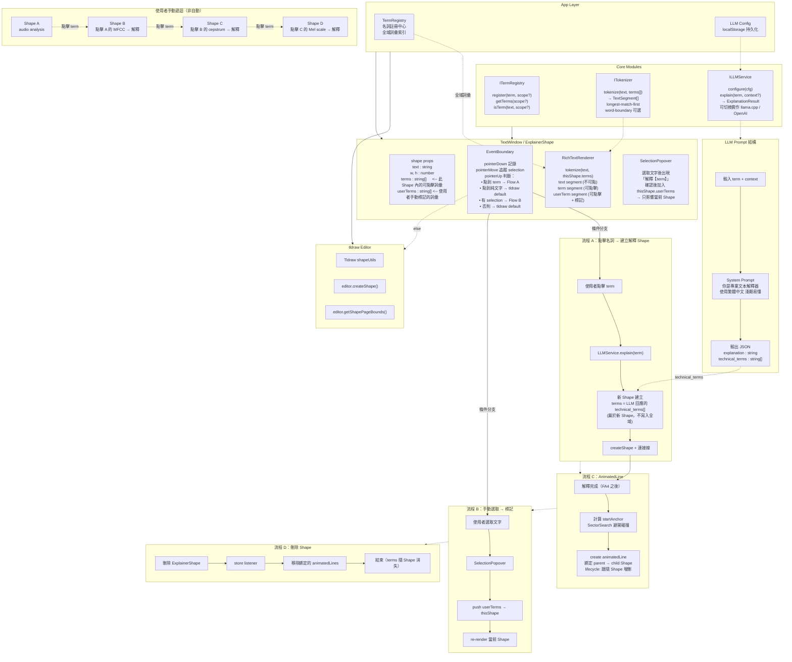

```mermaid
graph TD

%% ===========================
%% App Layer
%% ===========================
subgraph APP["App Layer"]
    A1["TermRegistry<br/>名詞註冊中心<br/>全域詞彙索引"]
    A2["LLM Config<br/>localStorage 持久化"]
end

%% ===========================
%% tldraw Editor
%% ===========================
subgraph TLDRAW["tldraw Editor"]
    T1["Tldraw shapeUtils"]
    T2["editor.createShape()"]
    T3["editor.getShapePageBounds()"]
end

%% ===========================
%% Core Modules
%% ===========================
subgraph MODULES["Core Modules"]
    M1["ITermRegistry<br/><br/>register(term, scope?)<br/>getTerms(scope?)<br/>isTerm(text, scope?)"]
    M2["ITokenizer<br/><br/>tokenize(text, terms[])<br/>→ TextSegment[]<br/>longest-match-first<br/>word-boundary 可選"]
    M3["ILLMService<br/><br/>configure(cfg)<br/>explain(term, context?)<br/>→ ExplanationResult<br/>可切換實作 llama.cpp / OpenAI"]
end

%% ===========================
%% TextWindow / ExplainerShape
%% ===========================
subgraph SHAPE["TextWindow / ExplainerShape"]
    S1["shape props<br/>text : string<br/>w, h : number<br/>terms : string[]     <-- 此 Shape 內的可點擊詞彙<br/>userTerms : string[] <-- 使用者手動標記的詞彙"]
    S2["EventBoundary<br/><br/>pointerDown 記錄<br/>pointerMove 追蹤 selection<br/>pointerUp 判斷：<br/>• 點到 term → Flow A<br/>• 點到純文字 → tldraw default<br/>• 有 selection → Flow B<br/>• 否則 → tldraw default"]
    S3["RichTextRenderer<br/><br/>tokenize(text, thisShape.terms)<br/>text segment (不可點)<br/>term segment (可點擊)<br/>userTerm segment (可點擊 + 標記)"]
    S4["SelectionPopover<br/><br/>選取文字後出現<br/>「解釋【term】」<br/>確認後加入 thisShape.userTerms<br/>→ 只影響當前 Shape"]
end

%% ===========================
%% Flow A：點擊名詞 → 遞迴建立新 Shape
%% ===========================
subgraph FA["流程 A：點擊名詞 → 建立解釋 Shape"]
    FA1["使用者點擊 term"]
    FA2["LLMService.explain(term)"]
    FA3["新 Shape 建立<br/>terms = LLM 回應的 technical_terms[]<br/>(屬於新 Shape，不寫入全域)"]
    FA4["createShape + 連接線"]
    FA1 --> FA2 --> FA3 --> FA4
end

%% ===========================
%% Flow B：手動選取 → 標記（只影響当前 Shape）
%% ===========================
subgraph FB["流程 B：手動選取 → 標記"]
    FB1["使用者選取文字"]
    FB2["SelectionPopover"]
    FB3["push userTerms → thisShape"]
    FB4["re-render 當前 Shape"]
    FB1 --> FB2 --> FB3 --> FB4
end

%% ===========================
%% Flow C：AnimatedLine（解釋完成時觸發）
%% ===========================
subgraph FC["流程 C：AnimatedLine"]
    FC1["解釋完成（FA4 之後）"]
    FC2["計算 startAnchor<br/>SectorSearch 避開碰撞"]
    FC3["create animatedLine<br/>綁定 parent → child Shape<br/>lifecycle: 跟隨 Shape 增刪"]
    FC1 --> FC2 --> FC3
end

%% ===========================
%% Flow D：刪除 Shape（cleanup）
%% ===========================
subgraph FD["流程 D：刪除 Shape"]
    FD1["刪除 ExplainerShape"]
    FD2["store listener"]
    FD3["移除綁定的 animatedLines"]
    FD4["結束（terms 隨 Shape 消失）"]
    FD1 --> FD2 --> FD3 --> FD4
end

%% ===========================
%% LLM Prompt 結構
%% ===========================
subgraph LLM_PROMPT["LLM Prompt 結構"]
    LP1["輸入 term + context"]
    LP2["System Prompt<br/>你是專業文本解釋器<br/>使用繁體中文 淺顯易懂"]
    LP3["輸出 JSON<br/>explanation : string<br/>technical_terms : string[]"]
    LP1 --> LP2 --> LP3
end

%% ===========================
%% 遞迴解釋：手動逐階
%% ===========================
subgraph RECURSION["使用者手動遞迴（非自動）"]
    R0["Shape A<br/>audio analysis"]
    R1["Shape B<br/>點擊 A 的 MFCC → 解釋"]
    R2["Shape C<br/>點擊 B 的 cepstrum → 解釋"]
    R3["Shape D<br/>點擊 C 的 Mel scale → 解釋"]
    R0 -.->|"點擊 term"| R1
    R1 -.->|"點擊 term"| R2
    R2 -.->|"點擊 term"| R3
end

%% ===========================
%% Relations
%% ===========================
APP --> TLDRAW
APP --> SHAPE
MODULES --> SHAPE

A1 -.->|全域詞彙| S3
A2 -.-> M3

M2 -.-> S3
M3 -.-> LLM_PROMPT
LP3 -.->|technical_terms| FA3

S2 -->|條件分支| FA1
S2 -->|條件分支| FB1
S2 -.->|else| TLDRAW

FA4 --> FC1
FA -.-> FC
FC -.-> FB
FB -.-> FD
```
